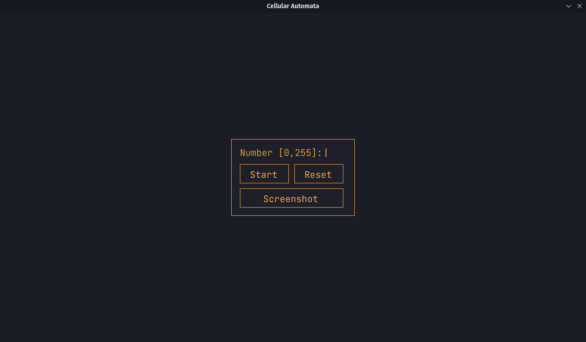

# Cellular-Automata

    O programa foi implementado em python com a biblioteca Pygame e tem como objetivo permitir a visualização de todas as 256 regras possíveis do Cellular Automata Binário. O modelo consiste em uma matriz de células que são atualizadas ao longo do tempo de acordo com regras simples. O modelo do Cellular Automata Binário é um caso particular em que as células podem assumir apenas dois estados: 0 ou 1.

# Funcionamento

    O usuário pode escolher a regra a ser visualizada a partir de um simples `menu` com botões de `Start e Reset`. Também é possível tirar capturas de tela, as capturas são salvas na pasta `screenshot` dentro da pasta principal do programa.

> O menu aparece apenas com o programa pausado
> 
> Para pausar o programa aperte a tecla `space`

 

> Requirements:
> 
> Pillow==9.4.0
> pygame==2.2.0

## Programa pausado

### Programa em funcionamento (regra 110)

# Algumas regras interessantes

- 73

- 45

- 30

- 22

- 110

- 150

- 225

- 214

- 105

- 99

- 101

- 89